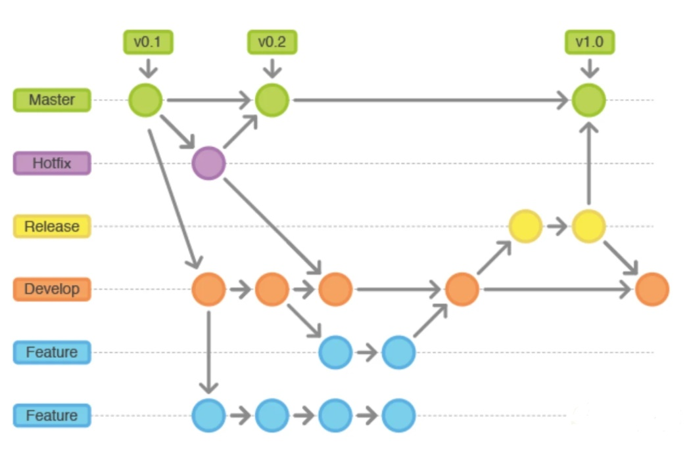

# Buenas prácticas en Git y Github
La diferencia entre Git y Github parte de entender quién controla y dónde se controla. 
Git es un sistema a base de comandos que nos permite controlar las versiones generadas en un proyecto. 
Github es el servidor donde puedes hospedar tu proyecto y a través de una interfaz web administrar las versiones generadas por git.

Si ya aprendiste a programar y quieres entrar en este mundo como todo un profesional Git y Github es algo que debes aprender y por supuesto hacerlo con las buenas prácticas te dará un bonus en tu carrera.

### 1. Elige un flujo de trabajo.
Es importante que conozcas o elijas un flujo de trabajo / workflow ya sea si colaboras en equipo o lo haces solo. Para eso es importante que identifiques las fases más importantes que ocurren mientras desarrollas, que analices el procedimiento a ejecutar cuando se necesita hacer cambios de emergencia contra bugs y muy importante que entiendas de qué forma es más fácil identificar los cambios del proyecto.

Existen numerosos flujos de trabajo que se adaptan a cada necesidad, te listo algunos:

- **Git Feature Branch Workflow:**
Todos los features deben tener una rama dedicada en lugar de concentrar todo en master.

- **Gitflow Workflow:**
Es similar al anterior solo que la estructura de ramas está diseñado alrededor de las entregas del proyecto.

- **Forking Workflow:**
En lugar de usar un solo repositorio centralizado le da la opción a cada colaborador de tener uno propio.

### 2. Utiliza una buena estructura en los mensajes de commits
Se recomienda que tus commits tengan una estructura que permita identificar el trabajo que realizaste en el proyecto. Entre más descriptivos sean tus mensajes mucho mejor.

**Puedes emplear algunos sufijos como:**

**feat:**
Describe si trabajaste en un nuevo feature

**fix:**
Describe si solucionaste un bug

**docs:**
Dice si hiciste algún cambio en la documentación

**test:**
Indica si añadiste un test

**refactor:**
Nos muestra que se ejecutó algún refactor en el código

De esta forma se puede tener mejor organizado todo el control de cambios además que lo hacen mucho más fácil de entender.

### 3. Envía tus cambios en pull-request
Un pull-request es una solicitud que hacemos al repositorio cuando enviamos código con cambios, idealmente el propietario del repositorio revisa el código y decide si es apto para ser integrado.

Tener una revisión previa del código antes de ser integrado es muy saludable no importa si estas en un equipo grande o pequeño enviar cambios sin aprobación puede provocar inconsistencias en el código.

 
[https://docs.microsoft.com/en-us/azure/devops/repos/git/merging-with-squash?view=azure-devops]

### 4. Añade solo los archivos en los que estuviste trabajando
Usar git add . definitivamente no es la mejor práctica, lo mejor en estos casos es añadir solo los archivos de los que estuviste trabajando, esto evita que se ingresen muchos archivos “trash” que pueden traer una repercusión grave en la dimensión del repositorio.

**Añadir los archivos individualmente:**
git add src/model/User.java
Es lo mejor para cuidar el hogar (hosting de control de cambios) de nuestro repositorio.

 
[https://www.atlassian.com/git/tutorials/saving-changes]

### 5. Usa una herramienta de integración continua
Cuando la buena práctica de usar pull-request en el equipo es parte de su cultura es importante pensar en formas de automatizar y tener más control sobre las revisiones.

**El flujo de trabajo de un desarrollador sería este:**

    -El desarrollador toma una tarea y trabaja en ella.
    -El desarrollador implementa sus propios test unitarios.
    -El desarrollador actualiza constantemente su repositorio local con git pull.
    -El desarrollador publica la tarea / feature.
    -El desarrollador se asegura de que sus pruebas unitarias y todas las pruebas de regresión
     pasen al servidor de compilación.
    -El desarrollador envía un pull-request.
     Se revisa si el código contenido en el pull-request es apto para integración y que
     todos los test pasen correctamente si todo está bien se integra automáticamente al servidor.
    -El administrador fusiona el pull-request que se crea y se implementa en la
     preparación para QA y UAT.
    -El servidor de compilación elimina la función remota.
    -El desarrollador borra la función local.